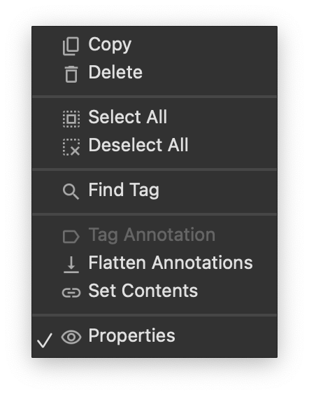
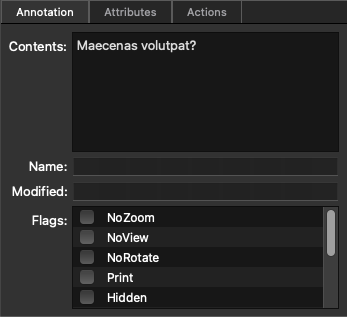
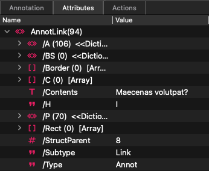
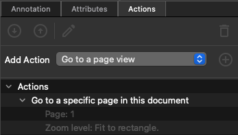

# Annotations

The  Annotation panel provides access to all of the document’s annotations to assist you in making them accessible.

## Annotation Actions

Link to [Annotation Actions](#)

## Annotations panel

### Annotation view

In the Annotations panel you can manually __Edit__, __Tag__ and __Delete__ selected annotations.

Click on the  Options menu (or right click) at the panel toolbar to see all available actions that works for the current annotation selection.

### Tag Annotation

Creates a new appropriate tag for the selected annotations. If disabled, it means the annotation is already tagged. You can use  __Find Tag__ to navigate to this tag.

### Delete Annotation

Clicking  __Delete__ will remove all selected annotations. Instead of outright deletion, consider Flatten annotations to preserve important information.

### Find Tag for Annotation

The  __Find Tag__ feature navigates to the associated annotation tag.

## Annotation Properties

Click Properties to see available annotation properties to edit. Change Contents key, annoatation flags, name or Modified key.

## Annotation Attributes

__Annotation Attributes__ provide low-level access to the Annotation object.

 We recommend using this for editing an annotation only if you have technical expertise.

## Annotation Actions

Each annotation can have an associated list of actions. You can add, remove, and edit actions in the __Actions__ tab in the  __Properties__ view.

