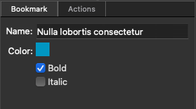

# Bookmarks

The  __Bookmark__ panel provides access to all of the document’s bookmarks.

For a PDF document with 21 or more pages, it’s essential to incorporate bookmarks that mirror the accessible document structure. This ensures that individuals using assistive technology have a smoother navigation experience within the PDF document.

## Bookmarks Actions

Link to [Bookmarks Actions](#)

## Bookmarks panel

### Bookmark view

#### Add Bookmark

 __Add Bookmark__ adds an empty bookmark as a sibling of the selected bookmark. After adding a new bookmark, you can set a bookmark’s action in the Properties widget.

#### Delete Bookmark

 __Delete Bookmark__ deletes selected bookmarks.

#### Edit Bookmark

 __Edit Bookmark__ to change a bookmark name.

### Bookmark Properties

Click on  __Properties__ to view available bookmark properties for editing. You can change the bookmark name, bookmark color, or bookmark font styling from this view.

### Bookmark Actions

Each bookmark can have an associated list of actions. You can add, remove and edit bookmark actions in the Actions tab within the  __Properties__ view.

