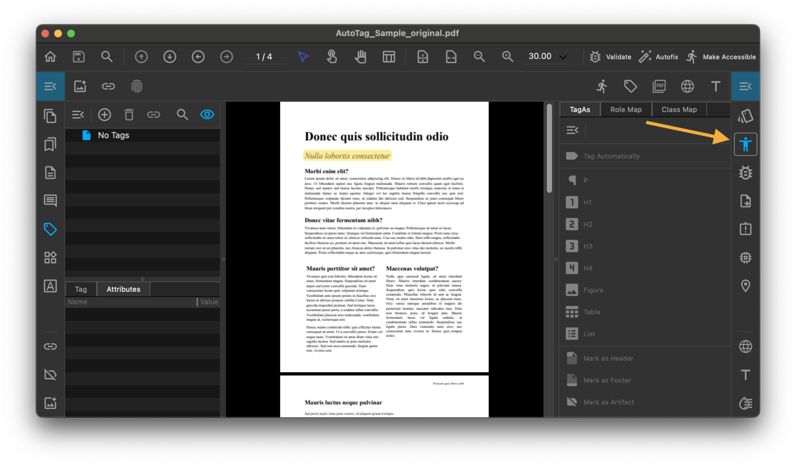
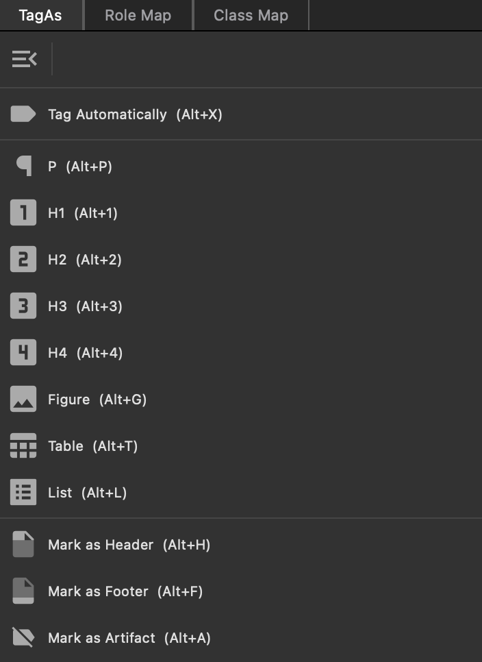

# Accessibility

With PDFix, you can ensure your PDFs are accessible and compliant with standards such as Web Content Accessibility Guidelines (WCAG) and PDF/UA (Universal Access).

The  __Accessibility panel__ offers a range of tools to make your documents accessible.

First, start by selecting whether your document is untagged or already contains tags.

- __Untagged PDF__
- __Tagged PDF__

For automated tagging, there are two high level commands available:

- [Make Accessible](workflow-for-creating-an-accessible-pdf/#make-accessible)
- [Autotag](workflow-for-creating-an-accessible-pdf/#autotag)

For manual tagging, the Accessibility pane provides quick access to Tag As commands.

## Accessibility Actions

Link to [Accessibility Actions](/actions/accessibility.md)

## TagAs view

The __TagAs__ view simplifies manual tagging by offering quick access to tags and providing easy access to them. You can set the most frequently used tags in [Preferences -> Accessibility](preferences.md#accessibility) tab.

Manual tagging works for different types of selection. Use [Default Tool](tools.md), [Object Tool]((tools.md)) or selection from [Content](content.md), [Tags](tags.md) or [Validation](validation.md) panels. When buttons are enabled, you can re-tag selected content with the desired type.

This action utilizes layout recognition algorithms in the background, allowing you to re-tag even complex content such as tables and lists.

## Role Map

 __Role Map__ matches each custom tag to a standard tag. When assistive software encounters a custom tag, it checks this role map to properly interpret the tags. Tagging PDFs using one of the methods described here generally produces a correct role map for the document.

Within the top toolbar menu, you can Add, Edit, or Delete role mappings. If the mapping of one or more non-standard types is semantically inappropriate, you can correct this error here.

## Class Map

 __Class Map__ store attributes that are associated with each object in your PDF document. Each tag within the document may have a list of names that identify the classes to which it belongs.

The option menu in the toolbar allows you to Add, Edit, or Delete any set of attributes associated with these class maps.