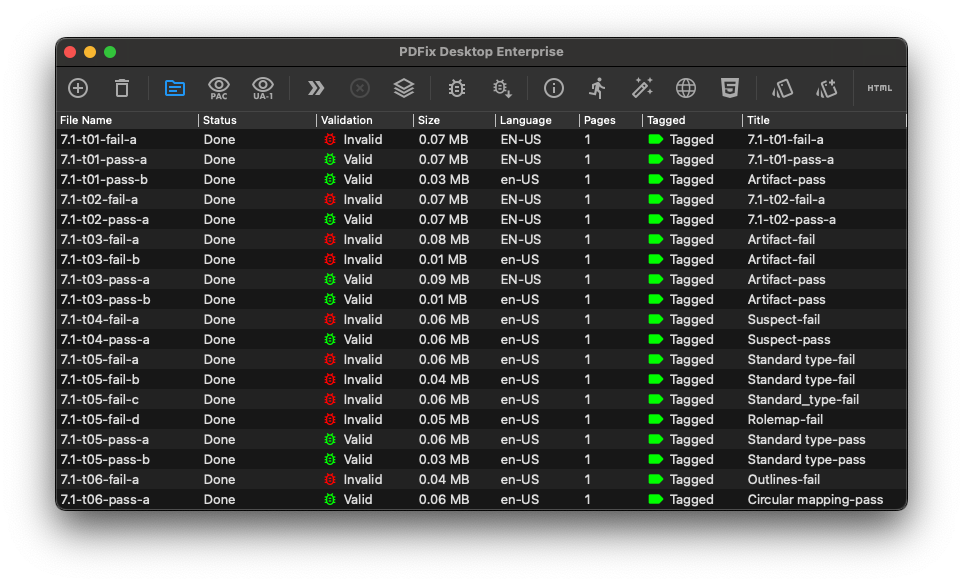
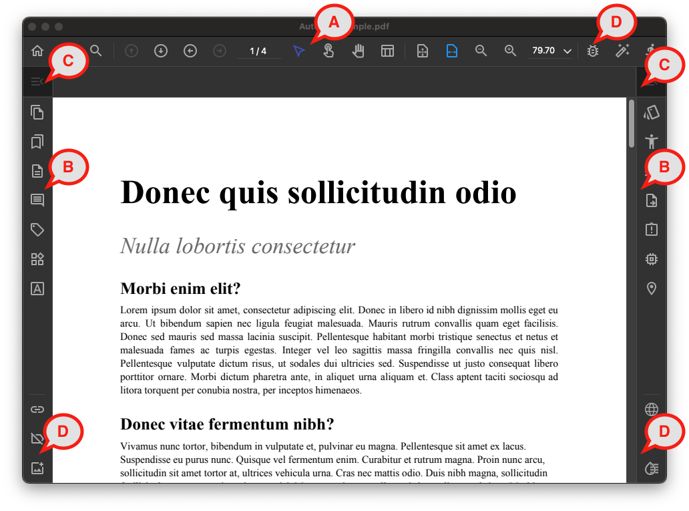
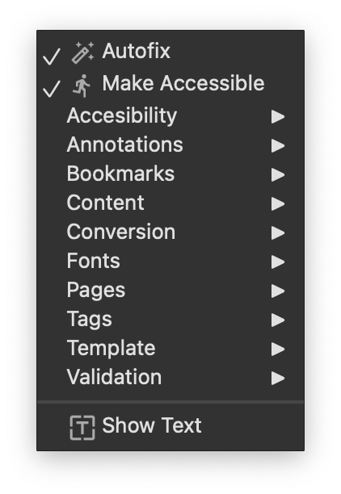

# Workspace

The PDFix Desktop application offers two different views

- [Application view](#application-view)
- [Document view](#document-view)

PDFix allows you to customize both workspaces within the Preferences dialog. For example you can customize the application theme or you can set keyboard Shortcuts for any commands.

In the Help->[License](license.md) menu you can manage your licenses and the product version.

## Application View

Application view displays the list of files on your system you’ve worked on. It is primarily designed for Batch Processing. PDFix provides batch processing commands to examine, validate, and repair PDFs in bulk.

### Application Main Toolbar
- Add and remove files
- Files view
- Manage and run commands

#### Add and remove files

Click  Add to add new files into the file view. To remove already listed, click Remove.

#### Files view
To view the list of working files, click  Files View. To view batch validation results, you can click on either the  PAC View or the  Clause View.

PDFix allows you to customize the File View columns within the [Preferences](preferences.md) dialog or with the right click on the file view header.

#### Manage and run commands

Access the  Commands dialog to manage all available commands and their parameters.

Click [Run Command](#) to execute a specific command on the selected files.

* Be carefull when using commands in the application view, as all changes are made directly to the file on the disk and cannot be undone!*

## Document view

Each PDF document can be opened in Document view. When you open multiple documents, each document opens as a new Document view window.

- __A__ – [Main toolbar](#main-toolbar)
- __B__ – [Side panels](#side-panels)
- __C__ – [Quick access menu](#quick-access-menu)
- __D__ – [Quick access toolbar](#quick-access-toolbar)

## Main toolbar

### Page navigation

-  __Find__ function enables searching within the document.
-  __Previous Page__ and  __Next Page__ tool buttons facilitate navigation through the pages. You can enter a page number into the text box to navigate directly to that page.
- __Previous View__ reverses the last navigation and __Next View__ navigates back to latest views
-  __Fit Page Width__,  __Fit Page__ &   __Zoom__ tool buttons adjust the page magnification, allowing you to customize the zoom level for better readability.

### Selection tools

[Selection tools](selection-tools.md) manage the selection within the document view.

-  __Default Tool__ is used to select page text or any rectangular area within the document.
-  __Object Tool__ allows you to select page content objects within the document.
-  __Table Tool__ is great for editing Table tags.
-  __Hand Tool__ navigates through different page areas or allows you to change the page zoom. It allows you to click to documents __Links__.

### Side panels

Side panels contain a set of tools for specific PDF features. Each side panel has its [Quick access menu](workspace.md#quick-access-menu). Commands from this menu can be easily added to side panel toolbars for fast access. Manage these toolbars in the same manner as as [Quick access toolbars](workspace.md#quick-access-toolbars).

PDFix enables you to customize the side panel in the [Preferences](preferences.md) dialog.

-  [Thumbnails](thumbnails.md)
-  [Bookmarks](bookmarks.md)
-  [Content](content.md)
-  [Annotations](annotations.md)
-  [Tags](tags.md)
-  [Layout Recognition](layout-recognition.md)
-  [Fonts](fonts.md)
-  [Template](template.md)
-  [Accessibility](accessibility.md)
-  [Validation](validation.md)
-  [Conversion](conversion.md)
-  [Format](format.md)
-  [Browser](browser.md)
-  [Destinations](destinations.md)

### Quick access menu

The  __Quick access menu__ is associated with a side panel, containing [commands](commands.md) that are logically connected to that specific side panel. These commands operate on the entire document.

### Quick access toolbar
PDFix allows you to customize the quick access toolbars for commands you want to quickly access while working on a document.

1. Right click on the quick access toolbar
2. Check the command you wand to add to the quick access toolbar
3. Check __Show Text__ if you want to see the button title

