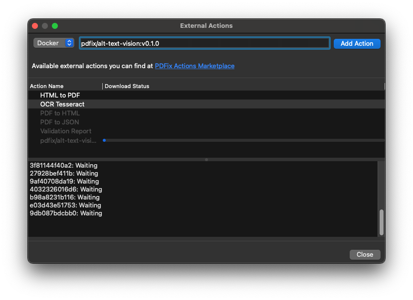

# External Actions

  __External actions__ enable you to enhance PDFix Desktop functionality by integrating external modules, leveraging the capabilities of AI.

 You can create custom private actions to use within the PDFix Desktop for process automation. Alternatively, you can download publicly available external actions to improve and streamline your workflows.

PDFix provides a variety of predefined external actions, which are regularly updated and added to the PDFix Actions Marketplace. Be sure to check them periodically for new additions.

PDFix offers several predefined external actions, which are continuously added to __PDFix Actions Marketplace__. Feel free to check them periodically.

## Available external actions

| Title | Name | Type |
| - | - | - |
| Language Detection | `pdfix/lang-detect:v0.4.3`	| Docker |
| OCR Tesseract | `pdfix/ocr-tesseract:v0.4.2` | Docker |
| HTML to PDF/UA | `pdfix/html-to-pdf:v0.3.0` | Docker |
| Alt Text Generator | `pdfix/alt-text-vision:v0.2.2` | Docker | 
| Alt Text Generator OpenAI | `pdfix/alt-text-openai:v0.4.3` | Docker |

## How to add the external action

The  External actions can be added in the Action Manager. PDFix Desktop supports two types of external actions:

- Docker
  - An action built in a docker container on your computer
- Local
  - An action based on a command-line application installed on your computer

Choose the __Type__ and type the __Name__ of the external actions you want to import. Click __Add Action__ to import the action into the PDFix.

>  __Warning:__ Ensure that Docker is running before adding a Docker action. If Docker is not installed or not running, the container will not be able to start.
> 
> ### Installing Docker
> If Docker is not already installed, follow the official installation guide on the [Docker website](https://www.docker.com/products/docker-desktop/) to set it up for your operating system.

## PDFix Actions Marketplace

### Language Detection

A Docker image that automatically detects the language of a PDF file.

https://hub.docker.com/r/pdfix/lang-detect

### OCR Tesseract

A Docker image that adds an OCR text layer to scanned PDF files using PDFix SDK and Tesseract OCR.

https://hub.docker.com/r/pdfix/ocr-tesseract

### HTML to PDF/UA

A Docker image that converts HTML pages to PDF/UA files using PDFix SDK and Google Headless Chrome.

https://hub.docker.com/r/pdfix/html-to-pdf

### Alt Text Generator

A Docker image that automatically generates and applies alternative image descriptions to PDF files.

https://hub.docker.com/r/pdfix/alt-text-vision

### Alt Text Generator OpenAI

A Docker image that automatically generates and applies alternative image descriptions to PDF files using PDFix SDK and OpenAI.

https://hub.docker.com/r/pdfix/alt-text-openai

### PDF/UA Validation VeraPDF

A Docker image that validates PDFs using veraPDF, the industry-supported open-source PDF/UA validator, and saves results as HTML, XML, or JSON reports. This PDF Accessibility Checker allows users to easily perform PDF validation with customizable validation profiles.

https://hub.docker.com/r/pdfix/validation

