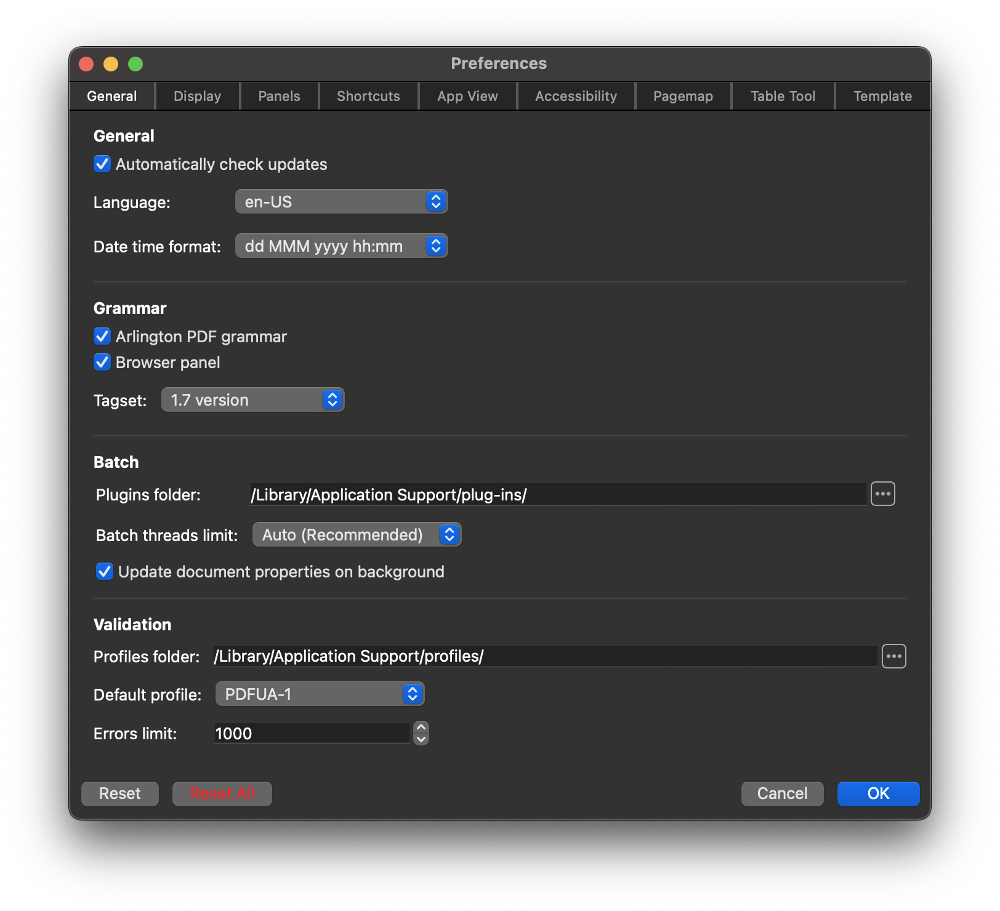
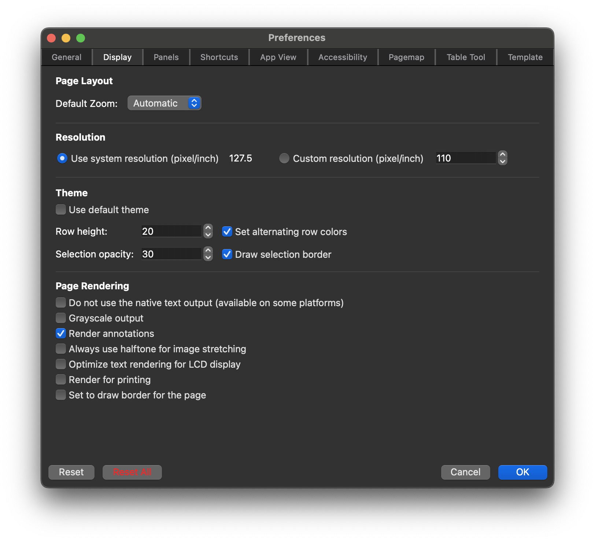
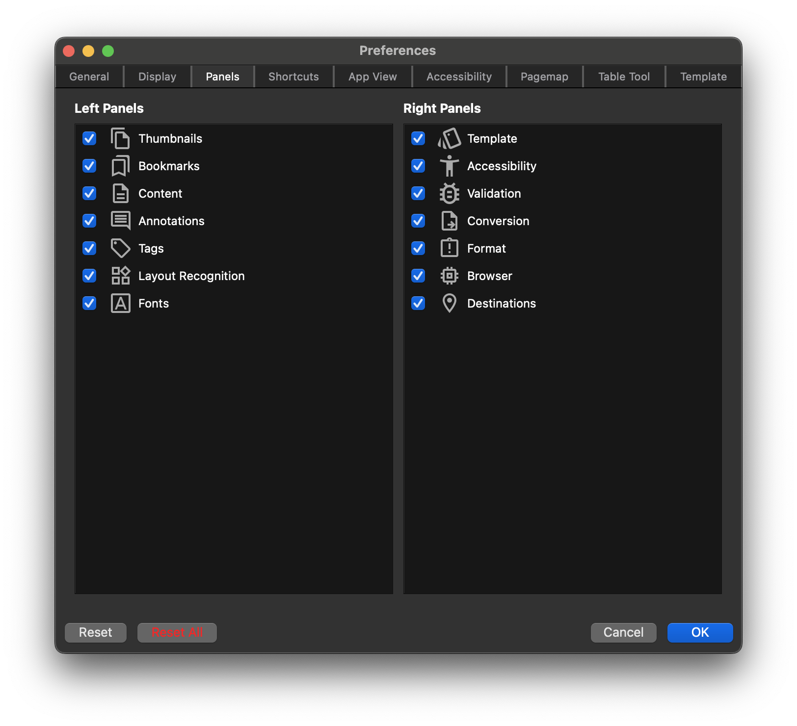
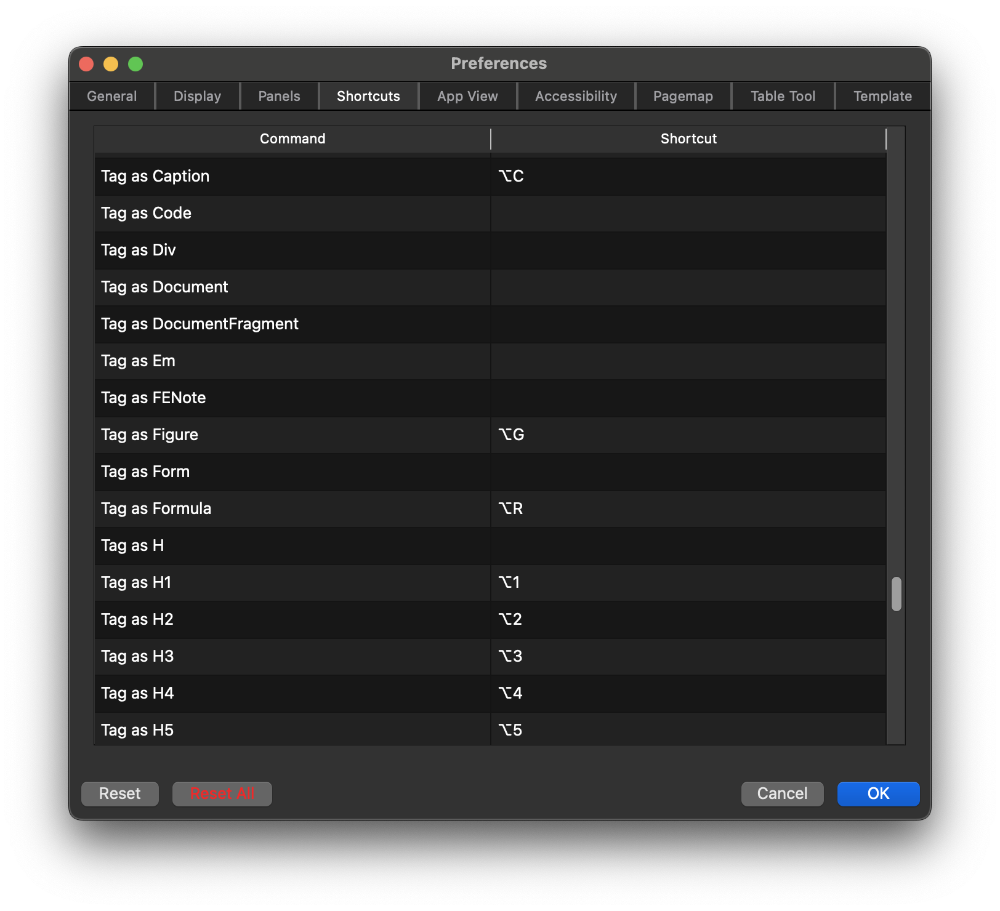
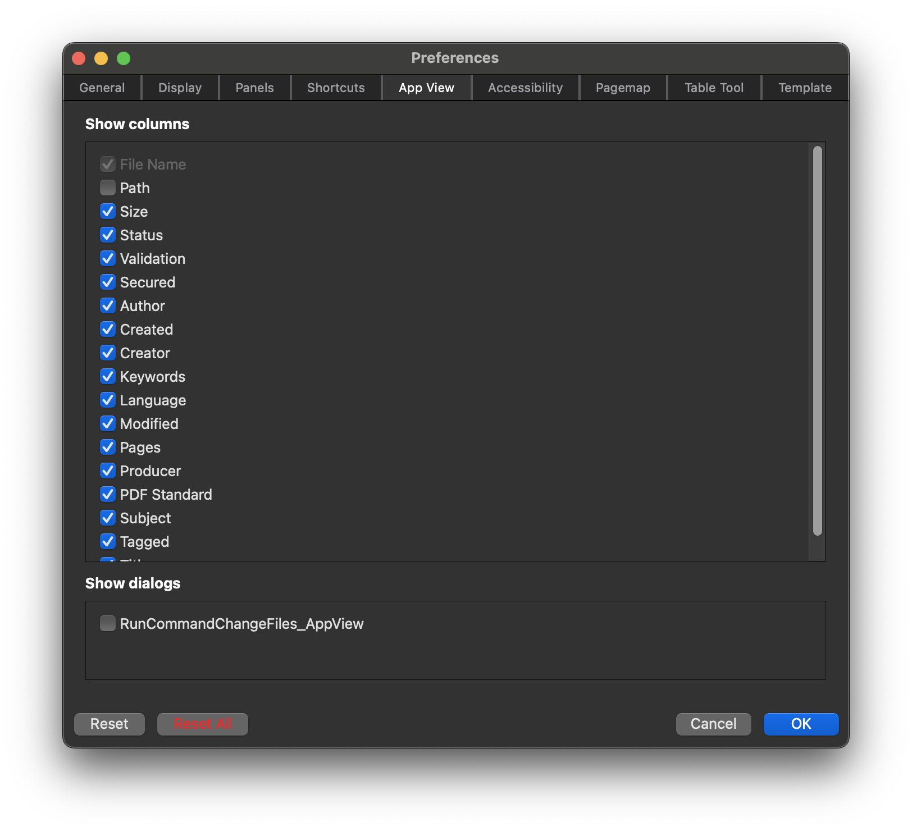
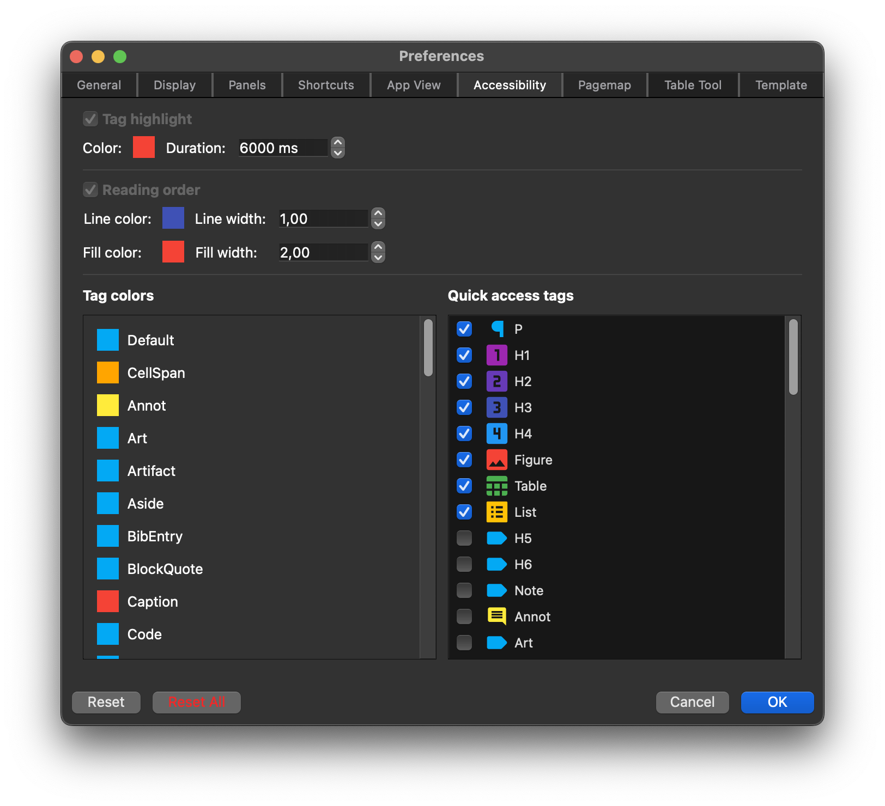
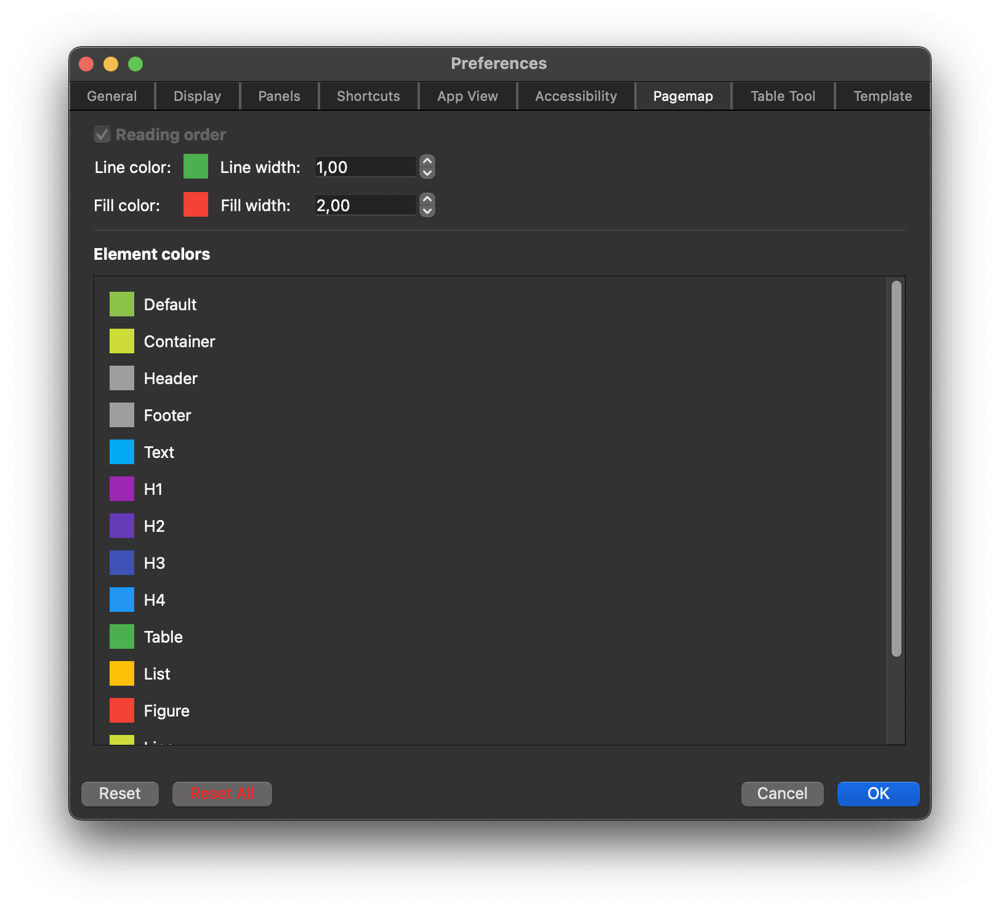
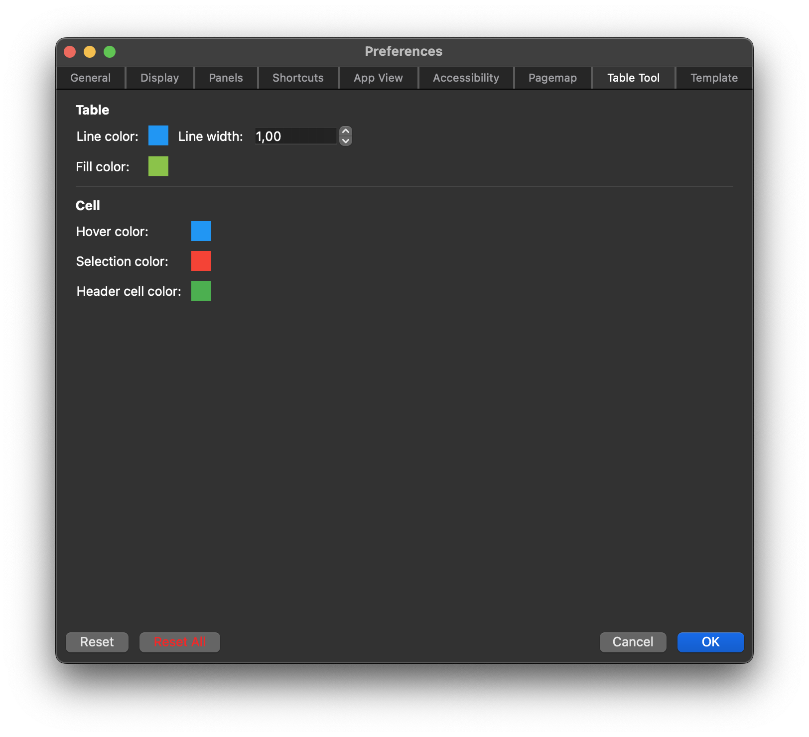
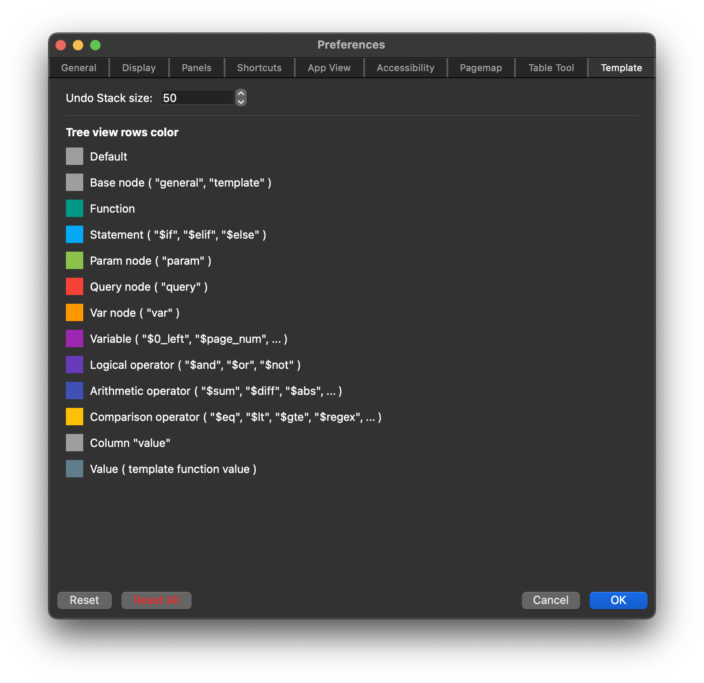

# Preferences

## General

### General

- __Language__ – application language
- __Date time format__ – application date time format

### Grammar

- __Arlington PDF grammar__ – when checked, low level editing follows the definition of the PDF document object model (DOM)
- __Browser panel__ – enables low level editing in the Browser panel
- __Tagset__ – standard tag names set

### Batch

- __Plugins folder__ – full path to the external plugins folder
- __Batch threads limit__ – maximum of concurrently running threads
- __Update document properties on background__ – if checked, the file view properties are updated each time the file is changed

### Validation

- __Default profile__ – default profile used for [Validation](validation.md)
- __Errors limit__ – number of errors that are listed in the [Validation view](validation.md)

## Display

## Panels

## Shortcuts

Customize shortcuts to accelerate your work.

## App View

## Accessibility

Quick access tags refer to a list of the most frequently used tags for utilization in document view menus and panels.

## PageMap

## Table Tool

Customized theme for the [table tool](table-tool.md).

## Template

