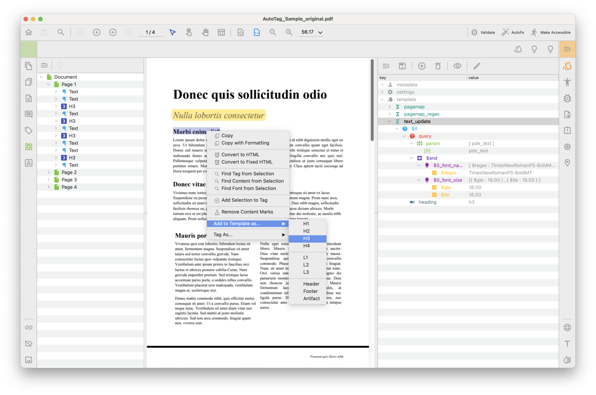

# Template

A Template serves as a tool for tailoring the content recognition algorithm, allowing for customization to match the specific requirements of the document.

Recognition can be tailored for specific objects by considering their type, style, position or other properies.

An example: Assist in identifying headings by analyzing the font name and size.

## Template configuration

Link to [Template configuration](#)